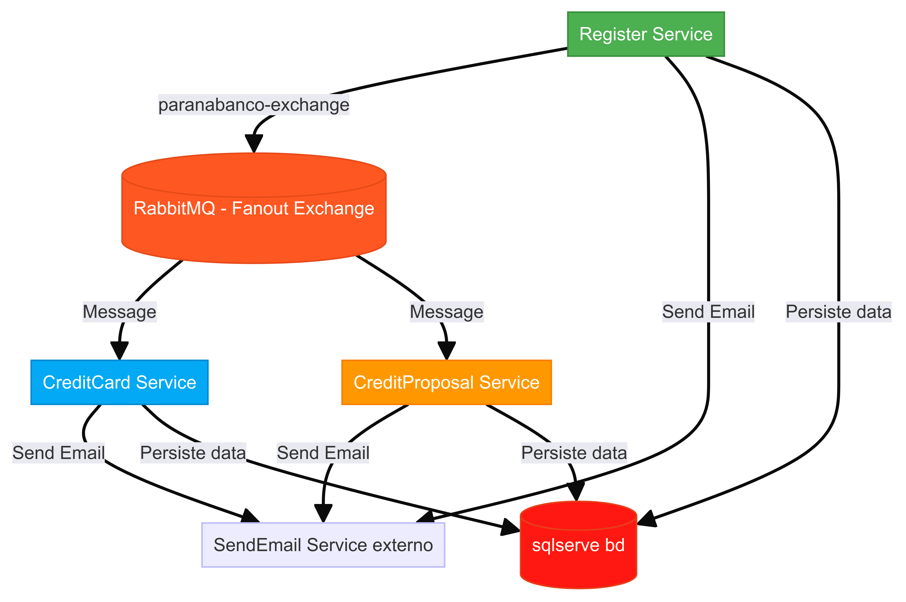

# Desafio Paranabanco

Serviços de cadastro, proposta de credito e cartão de credito.

## 🚀 Começando


Essas instruções permitirão que você obtenha uma cópia do projeto em operação na sua máquina local para fins de desenvolvimento e teste.

* SSH
```
git clone git@github.com:jadeilsonm/paranabanco.git
```

* HTTPS
```
git clone https://github.com/jadeilsonm/paranabanco.git
```


## 📋 Pré-requisitos

- Docker - (opcional)*
- .net na versão 8
- Banco de dados sqlserver
- RabbitMq

## 🐋 Executando com docker:

Para executar essa aplicação via docker vc deve seguir os caminhos abaixo.

Estar dentro do diretorio do projeto, se não estiver realize o seguinte comando a baixo no seu terminal:
```sh
cd /paranabanco
```
Inicialize o compose do docker por meio do seu terminal:
```sh
docker-compose up -d --build
```
Após inicializar os container docker podera acessar em seu navegador o seguinte caminho:
[swagger](http://localhost:5000/swagger) - Swagger da aplicação de cadastro
[swagger](http://localhost:5002/swagger) - Swagger da aplicação de Proposta de credito
[swagger](http://localhost:5004/swagger) - Swagger da aplicação de Cartão de credito

## UML



## 📦 Desenvolvimento

Neste projeto tive como grande desafio o relacionamento entre os dados, onde decide resolver com 3 tabelas, tabelas essas por nome de accounts, actives e investiments.

Foi utilizado o modelo MSC para dividir as responsabilidades de cada funções, camada da aplicação dando assim mais visibilidade e legibilidade para cada arquivo.

A utilização do token JWT para fazer a verificação da autorização do usaurio em algumas operações como sacar e depositar dinheiro, alem de comprar ativos.

Como forma de minimizar erros em no desenvolvimeto foi utilizado o typeScript para tipar variaveis e paramentro.

## 🛠️ Construído com:

ferramentas usadas para criar o projeto.

* [.NET](https://dotnet.microsoft.com/pt-br/learn/dotnet/what-is-dotnet) - é uma plataforma de aplicativo gratuita e de código aberto com suporte da Microsoft
* [SQLSERVE](https://www.microsoft.com/pt-br/sql-server/sql-server-2022) - Utilizado para armazenar os dados.
* [RabbitMq](https://www.rabbitmq.com/) - é um broker de mensagens e streaming confiável e maduro, que é fácil de implementar em ambientes de nuvem, no local e na sua máquina local.
* [Swagger](https://swagger.io/) - Utilizado para documentação.
* [Docker](https://www.docker.com/) - Utilizado para teste da aplicação.


## 📌 Versão

* versão 1.0

* Foi utilizado [github](https://github.com/) para controle de versão e armazenamento de codigo fonte.

## ✒️ Autores

* **desenvolvedor** - *Trabalho Inicial* - [desenvolvedor](https://github.com/jadeilsonm)


## 🎁 Expressões de gratidão

* Conte a outras pessoas sobre este projeto 📢
* Convide alguém da equipe para uma café ☕ 
* Obrigado publicamente 🤓.
